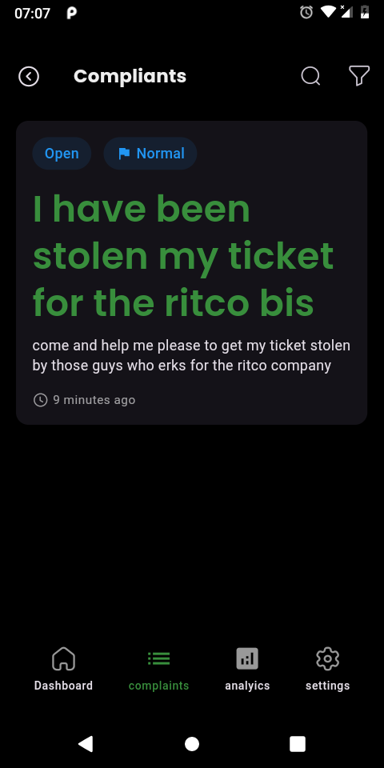
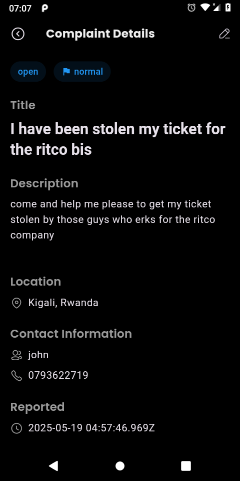
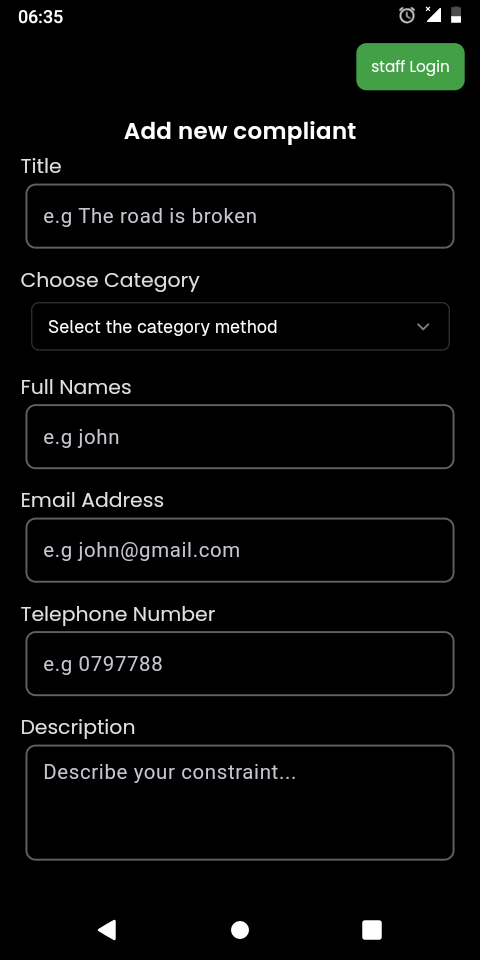
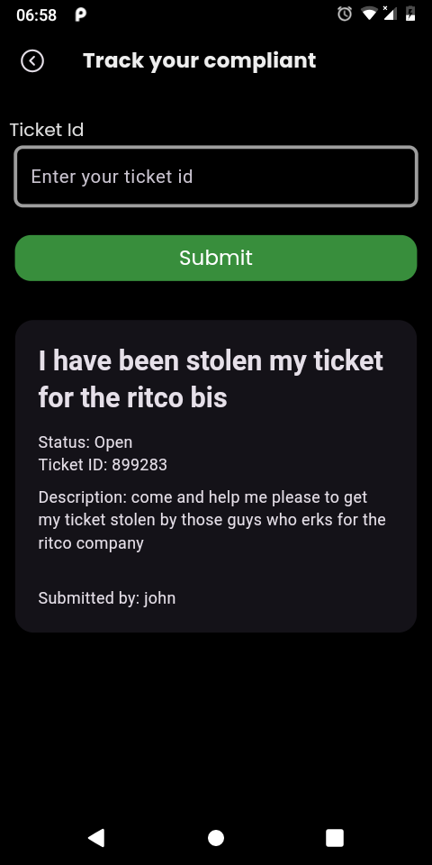
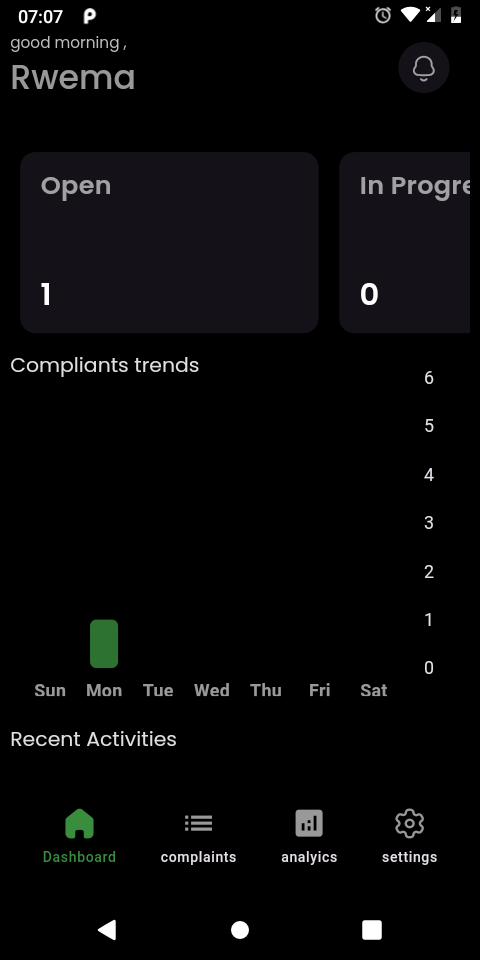
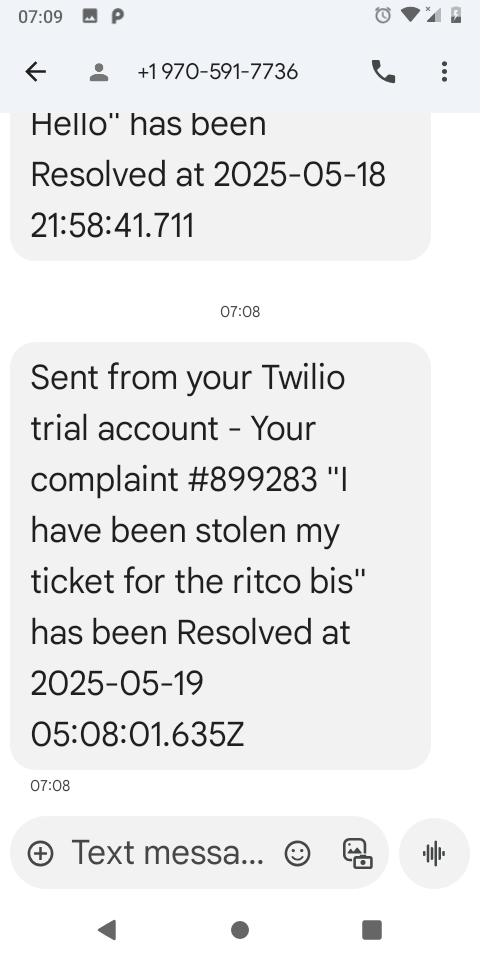

# Complaint Management System (CMS)

<!--  -->

## 📱 Overview
CMS is a comprehensive complaint management system that enables citzens to submit, track, and manage complaints efficiently. The system provides real-time updates, offline support, seamless synchronization between mobile app and server, and advanced dasboard and analytics for staff management.

## 🚀 Features

### Core Features
- 📝 **Submit and Track Complaints** - Create, view, and manage complaints with detailed information
- 🔄 **Real-time Status Updates** - Live updates on complaint status changes
- 📱 **Offline Support** - Full functionality with local storage using Hive database
- 🔐 **Secure Authentication** - JWT-based authentication with role-based access
- 📊 **Department-wise Management** - Organized complaint handling by departments
- 🔔 **SMS Notifications** - Automated status updates via Twilio SMS service
- 🌓 **Dark/Light Theme** - Customizable theme with system preference support
- 📈 **Advanced Analytics** - Comprehensive dashboard with charts and metrics

### User Interface
- 🎨 **Modern Material Design** - Beautiful and intuitive user interface
- 📱 **Cross-platform Support** - Android & iOS compatibility
- 🔄 **Responsive Layouts** - Adaptive design for different screen sizes
- 🎯 **Custom Widgets** - Reusable components for consistent UX

### Analytics & Reporting
- 📊 **Status Distribution Charts** - Pie charts showing complaint status breakdown
- 📈 **Priority Distribution** - Bar charts for priority level analysis
- ⏱️ **Resolution Time Analysis** - Average resolution time metrics
- 📋 **Summary Cards** - Quick overview of key metrics
- 🔍 **Search & Filter** - Advanced filtering by status, priority, category, and more

## 🛠 Tech Stack

### Frontend (Mobile App)
- **Framework**: Flutter 3.2.3+
- **State Management**: Flutter Bloc with Hydrated Bloc for persistence
- **Local Storage**: Hive database for offline data storage
- **HTTP Client**: http package for API communication
- **Charts**: fl_chart for analytics visualization
- **UI Components**: 
  - Material Design 3
  - Google Fonts (Poppins)
  - Custom widgets and components
  - Responsive layouts

### Backend Integration
- **Base URL**: https://cms-qctx.onrender.com
- **Authentication**: JWT tokens
- **Database**: MongoDB
- **SMS Service**: Twilio integration

### Key Dependencies
- `flutter_bloc` - State management
- `hive` - Local database
- `hydrated_bloc` - Persistent state
- `connectivity_plus` - Network connectivity
- `fl_chart` - Data visualization
- `google_fonts` - Typography
- `iconly` - Icon library

## 🔌 API Endpoints

### Authentication
```dart
POST /signUp          - User registration
POST /signIn          - User login
GET  /logout          - User logout (requires auth)
```

### Complaints Management
```dart
POST   /complaints/create           - Create new complaint
GET    /complaints/department       - Get department complaints (requires auth)
PUT    /complaints/update/:id       - Update complaint (requires auth)
DELETE /complaints/delete/:id       - Delete complaint (requires auth)
GET    /complaints/:id              - Get specific complaint (requires auth)
```

### Request/Response Format
```dart
// Create Complaint Request
{
  "title": "string",
  "description": "string", 
  "category": "string",
  "location": "string",
  "submittedBy": "string",
  "status": "open|inProgress|resolved|rejected",
  "telephoneNumber": "string"
}

// Authentication Response
{
  "data": {
    "accessToken": "jwt_token",
    "user": {
      "id": "string",
      "name": "string",
      "email": "string",
      "department": "string",
      "telephone": "number"
    }
  }
}
```

## 📊 Analytics Dashboard

### Metrics Overview
- **Total Complaints** - Overall complaint count
- **Resolved Complaints** - Successfully closed complaints
- **Pending Complaints** - Open complaints awaiting action
- **In Progress** - Complaints currently being handled

### Visual Analytics
- **Status Distribution Pie Chart** - Visual breakdown of complaint statuses
- **Priority Distribution Bar Chart** - Priority level analysis
- **Resolution Time Analysis** - Average time to resolve complaints
- **Real-time Updates** - Live data synchronization

### Filtering & Search
- Filter by status (Open, In Progress, Resolved, Rejected)
- Filter by priority (High, Medium, Low)
- Filter by category and department
- Search by title, description, location, or phone number

## 🌓 Theme Support

### Light Theme
- Clean white background with subtle shadows
- Green primary color scheme
- High contrast text for readability
- Professional appearance

### Dark Theme
- Dark background with reduced eye strain
- Consistent green accent colors
- Optimized text contrast
- Modern dark mode experience

### Features
- **System Preference Detection** - Automatically follows device theme
- **Manual Theme Toggle** - User can override system preference
- **Persistent Settings** - Theme choice saved across app sessions
- **Smooth Transitions** - Animated theme switching

## 📱 Offline Capabilities

### Local Storage
- **Hive Database** - Fast local data storage
- **Complaint Caching** - All complaints stored locally
- **User Data Persistence** - Authentication and user info cached
- **Offline Form Submission** - Queue complaints for sync when online

### Synchronization
- **Automatic Sync** - Background synchronization when online
- **Conflict Resolution** - Smart merging of local and server data
- **Connectivity Detection** - Real-time network status monitoring
- **Data Integrity** - Ensures data consistency across devices

## 🔔 SMS Notifications

### Twilio Integration
- **Status Updates** - Automatic SMS when complaint status changes
- **Custom Messages** - Personalized notifications with complaint details
- **Fallback Support** - Multiple sender ID options for reliability
- **Error Handling** - Graceful failure handling with logging

### Message Format
```
Your complaint #[ID] "[Title]" has been [Status] at [Date]
```

## 📦 Project Structure
```
lib/
├── bloc/                    # State management
│   ├── auth/               # Authentication state
│   ├── compliant/          # Complaint state management
│   ├── category/           # Category management
│   └── department/         # Department management
├── components/             # UI components
│   ├── __dashboard__/      # Dashboard components
│   ├── forms/              # Form components
│   └── navigators/         # Navigation components
├── config/                 # Configuration files
│   └── theme/              # Theme configuration
├── cubit/                  # Simple state management
│   └── theme.dart          # Theme state
├── data/                   # Data layer
│   ├── graphs/             # Analytics data models
│   ├── models/             # Data models
│   └── repositories/       # Data repositories
├── screens/                # App screens
│   ├── admin/              # Admin interface
│   │   ├── auth/           # Authentication screens
│   │   └── dashboard/      # Admin dashboard
│   └── citizens/           # Citizen interface
├── services/               # External services
│   └── sms_service.dart    # SMS integration
├── utils/                  # Utility functions
│   ├── auth_manager.dart   # Authentication utilities
│   └── connectivity_utils.dart # Network utilities
└── widgets/                # Reusable widgets
    ├── forms/              # Form widgets
    └── graphs/             # Chart widgets
```

## 🚀 Getting Started

### Prerequisites
- Flutter SDK (3.2.3 or higher)
- Android Studio / VS Code
- Android SDK / Xcode (for mobile development)

### Installation

1. **Clone the repository**
```bash
git clone https://github.com/yourusername/cms.git
cd cms
```

2. **Install Flutter dependencies**
```bash
flutter pub get
```

3. **Generate Hive models** (if needed)
```bash
flutter packages pub run build_runner build
```

4. **Configure environment variables**
Create a `.env` file in the root directory:
```env
API_URL=https://cms-qctx.onrender.com
SMS_ACCOUNT_SID=your_twilio_sid
SMS_AUTH_TOKEN=your_twilio_token
SMS_SENDER_ID=your_sender_id
```

5. **Run the app**
```bash
flutter run
```

## 📱 Screenshots

### Complaint List


### Complaint Details


### Create Complaint


### Check Status


### Admin Dashboard


### SMS Notifications


## 🔄 Data Flow

### Complaint Creation Flow
1. **User Input** - Fill complaint form with details
2. **Local Storage** - Save to Hive database immediately
3. **Server Sync** - Upload to server when online
4. **SMS Notification** - Send confirmation to user
5. **Status Updates** - Real-time updates via API

### Offline/Online Sync
1. **Offline Mode** - All operations work locally
2. **Connectivity Detection** - Monitor network status
3. **Background Sync** - Automatically sync when online
4. **Conflict Resolution** - Merge local and server data
5. **Data Consistency** - Ensure data integrity

## 🔐 Security Features
- **JWT Authentication** - Secure token-based authentication
- **Role-based Access** - Different permissions for users and admins
- **Data Encryption** - Secure data transmission
- **Input Validation** - Client and server-side validation
- **Token Management** - Automatic token refresh and storage

## 📊 Performance Optimizations
- **Lazy Loading** - Efficient data loading
- **Local Caching** - Fast offline access
- **Optimized State Management** - Minimal rebuilds with Bloc
- **Efficient API Calls** - Smart caching and request optimization
- **Memory Management** - Proper disposal of resources

## 🧪 Testing
- **Widget Testing** - UI component testing
- **Unit Testing** - Business logic testing
- **Integration Testing** - End-to-end testing

## 🤝 Contributing
1. Fork the repository
2. Create your feature branch (`git checkout -b feature/AmazingFeature`)
3. Commit your changes (`git commit -m 'Add some AmazingFeature'`)
4. Push to the branch (`git push origin feature/AmazingFeature`)
5. Open a Pull Request

## 📄 License
This project is licensed under the MIT License - see the [LICENSE](LICENSE) file for details.

## 👥 Author
- **Rwema Isingizwe Norbert**
- GitHub: (https://github.com/RWEMAISINGIZWENorbert)

## 🙏 Acknowledgments
- Flutter team for the amazing framework
- Bloc library for state management
- Twilio for SMS services
- Hive for local database
- All contributors and testers
